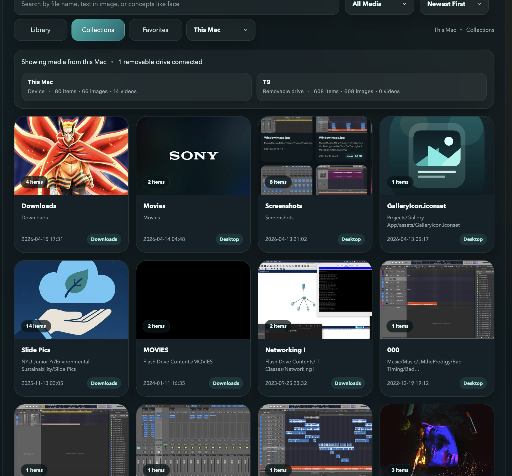
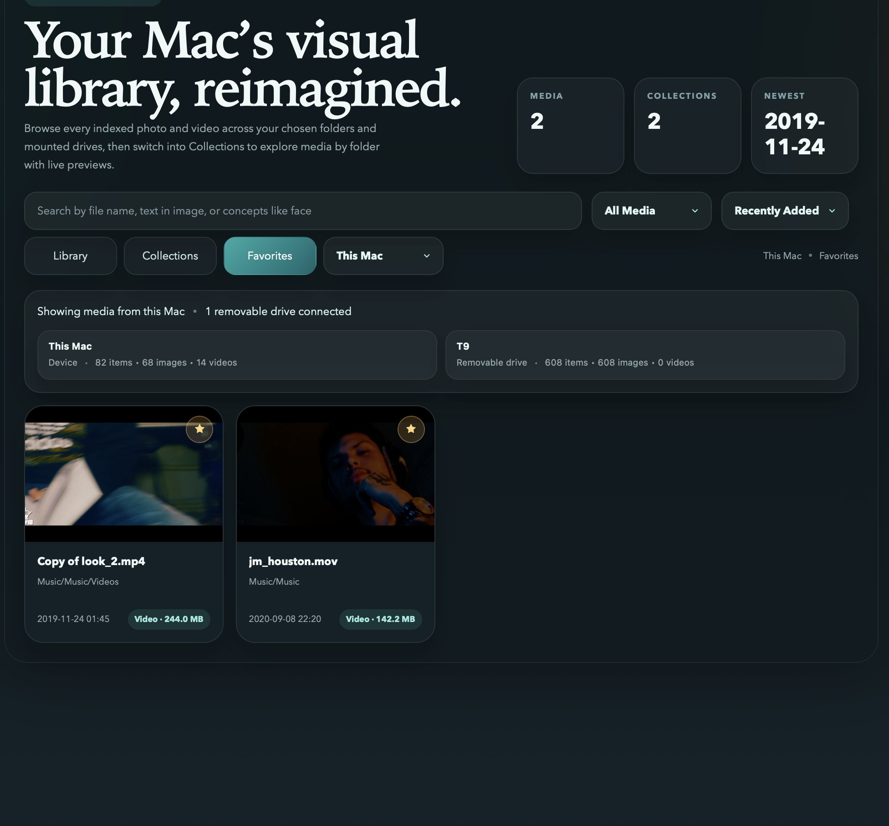
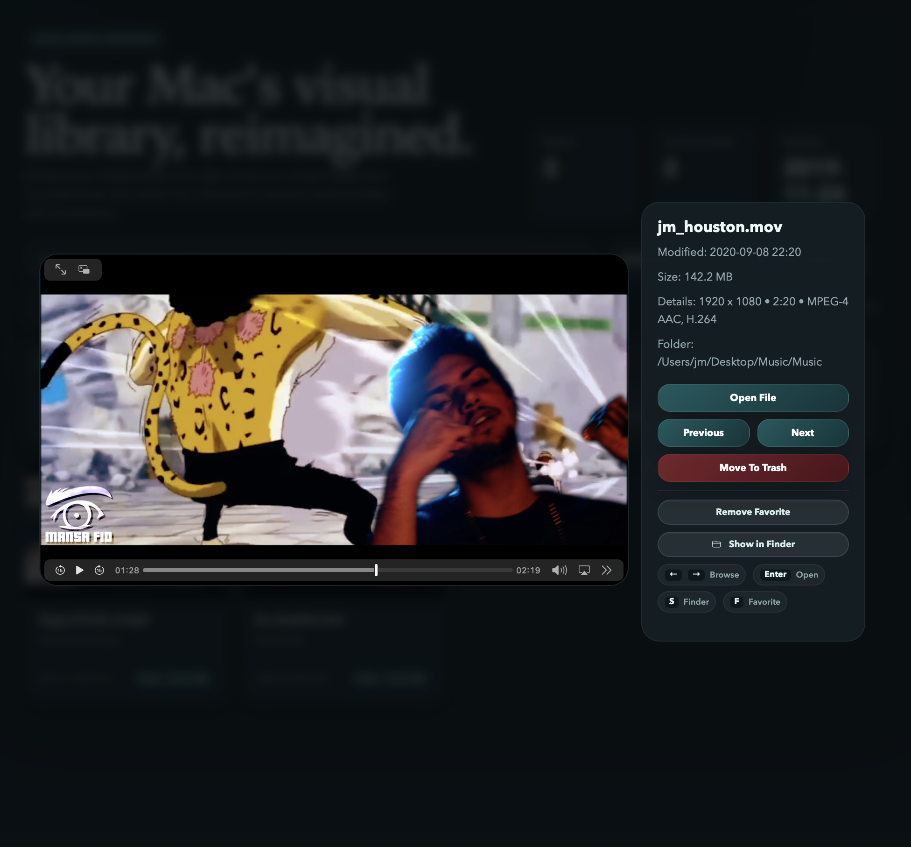
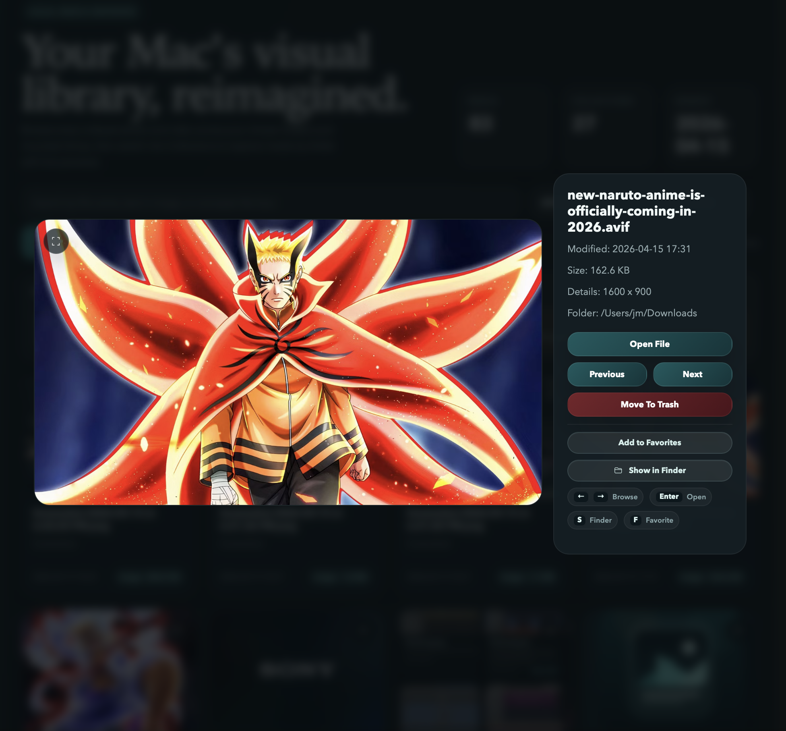

# Local Media Gallery

A local-first media browser for macOS that indexes photos and videos from your Mac and attached drives, then presents them in a clean gallery UI with device-based browsing, collections, favorites, search, and file actions.

## Overview

This project started as a practical local tool for browsing personal media without depending on cloud storage or a hosted backend. The app runs entirely on the local machine and is designed around a simple product decision: keep sources understandable, keep actions useful, and make the gallery feel fast enough for everyday use.

The current version supports:

- device-scoped browsing for `This Mac` and attached removable drives
- `Library`, `Collections`, and `Favorites` views
- local-first search using file names, folder names, and Spotlight-assisted matching
- image and video previews with a lightbox viewer
- Finder actions such as open, reveal, and move to Trash
- cached video poster thumbnails
- automatic updates as files and drives change
- offline use through a local server and local index

## Screenshots

### Collections view

Folder-based browsing grouped by source, with separate device cards for `This Mac` and attached removable storage.

### Favorites view

Local-only favorites with a dedicated sort mode and the same device-aware layout as the rest of the app.

### Video lightbox

The lightbox viewer for video, including playback, metadata, file actions, and keyboard shortcut hints.

### Image lightbox

Image viewing with dimensions, file details, Finder integration, and desktop file actions.

## Key Features

### Device-based browsing

The UI is organized by source instead of mixing all indexed media together.

- `This Mac` is always available
- attached drives appear as separate sources while connected
- disconnected drives disappear from the UI instead of lingering as missing devices
- device cards are clickable and also mirrored in the source picker

### Main views

#### Library

The primary media grid for the selected source.

- images and videos shown together
- media type and size displayed on each card
- folder-relative path shown in the metadata area
- direct entry point into the lightbox

#### Collections

Folder-based browsing for the selected source.

- media grouped by folder
- latest item used as the folder preview
- supports video poster thumbnails for collection covers
- selecting a collection opens that folder in library view

#### Favorites

Saved items from `This Mac`.

- stored locally in browser storage
- intentionally limited to local media in this version
- includes a `Recently Added` sort mode
- removable-drive items are excluded to avoid fragile favorites tied to temporary storage

### Search, filtering, and sorting

The app supports:

- search by file name
- search by folder name
- Spotlight-assisted search for broader matching
- filter by media type
- sort by newest, oldest, name, and size
- favorites-specific sorting by recently added

### Lightbox and file actions

The lightbox is the main detail view and action surface.

Available actions:

- open file in the default macOS app
- show the file in Finder
- move the file to Trash
- browse previous and next media
- toggle local favorites when supported
- fullscreen image viewing

The lightbox also surfaces richer metadata when available:

- dimensions
- file size
- modified time
- video duration
- video codecs

### Keyboard shortcuts

Supported shortcuts:

- `Left Arrow` and `Right Arrow` to browse
- `Enter` to open the file
- `S` to show the file in Finder
- `F` to favorite or unfavorite local media
- `Delete` and `Backspace` to move an item to Trash
- `Escape` to close the lightbox
- `/` to focus search

### Live updates

The app does not require a manual refresh for common changes.

It now picks up:

- newly attached drives
- removed drives
- new downloads
- moved files
- deleted files
- newly indexed formats such as AVIF

The current implementation uses a local indexer plus lightweight polling and change detection to keep the UI current while the app is open.

## Supported Media

### Images

- PNG
- JPG / JPEG
- WEBP
- GIF
- HEIC
- AVIF
- BMP
- TIFF

### Video

- MP4
- MOV
- M4V
- AVI
- MKV
- WEBM

## Technical Design

### Frontend

`index.html`

- renders the gallery UI and lightbox
- manages search, filters, sorting, and source selection
- stores favorites in localStorage
- polls the local API for updates

### Local server

`gallery_server.py`

- serves the UI and library payload
- serves media and thumbnail files
- handles Spotlight-assisted search
- handles file actions such as open, reveal, and trash
- prunes stale missing-file entries before serving the library
- triggers background syncs when watched roots or mounted volumes change

### Indexer

`scripts/sync_gallery_data.py`

- scans configured roots
- builds the media index and collection summaries
- captures metadata such as size, dimensions, duration, and codecs
- generates video poster thumbnails
- preserves usable index data when some roots are unreadable
- excludes internal cache directories from being indexed as user media

### Launcher and background indexing

- `Open Screenshot Gallery.command` starts the local server and opens the app quickly
- `scripts/open_screenshot_gallery.applescript` is the launcher-app source
- `scripts/install_media_gallery_background.sh` installs the background indexing setup for macOS

## What I Drove

This project was AI-assisted during implementation, but the product direction and iteration strategy were mine.

I was responsible for:

- defining the product shape and deciding what the app should actually do
- shifting the gallery from mixed-source browsing to device-scoped browsing
- deciding how favorites should work and where to keep the feature intentionally constrained
- prioritizing file actions and desktop-focused workflows over unnecessary features
- refining the UI around clarity, not just functionality
- pushing the app from a static prototype toward a tool that updates live as files and drives change
- making decisions about what to cut in order to keep the project focused and migration-ready

## Project Strengths

The strongest parts of this project are:

- clear product decisions instead of feature sprawl
- local-first architecture with no cloud dependency
- practical file-system integration for a desktop workflow
- thoughtful handling of removable storage
- stronger-than-usual prototype polish in the interaction model
- an indexer, server, and UI that work together as a coherent system

## Known Limits

This is still a local prototype rather than a packaged native macOS app.

Current limits:

- background indexing can still run into macOS privacy restrictions depending on folder access
- live updates are near-real-time rather than fully event-driven
- settings and onboarding are minimal
- the app is designed for local use, not multi-user distribution in its current form

## Lessons Learned

A few implementation lessons mattered a lot here:

- internal cache data should be kept clearly separate from indexed user media
- path independence should be built in from the start
- product rules should be locked early to avoid wasted UI rework
- live update behavior is much better when it is treated as a system, not a patch added later

## Repository Structure

- `index.html`
- `gallery_server.py`
- `scripts/sync_gallery_data.py`
- `scripts/install_media_gallery_background.sh`
- `scripts/open_screenshot_gallery.applescript`
- `Open Screenshot Gallery.command`
- `assets/`

## Notes For Public Review

This repository intentionally excludes local media indexes, logs, caches, and machine-specific artifacts. The app is designed around real local files, but the published repo is structured as source code and project assets rather than a snapshot of personal data.
